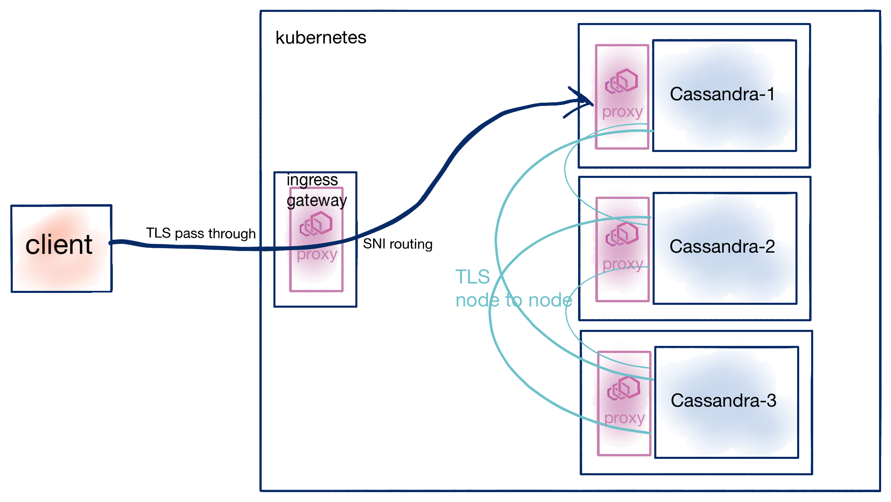

# Datastax Cassandra with Istio and SNI routing

[Cassandra][cass] is a very popular "NoSQL" database. Cassandra is a highly distributed document database that can be tolerant to certain types of failures and scaled for data-intensive microservices. As Kubernetes has become the defacto container deployment platform for microservices, running stateful workloads like Cassandra is a common choice. There are quite a few guides showing how to [deploy Cassandra on Kubernetes as a StatefulSet][kube-stateful] but there are much fewer guides for connecting applications running outside of the Kubernetes cluster to the Cassandra database running inside the cluster. At Solo.io we help customers and prospects operationalize microservices networking and routing technology built on Envoy proxy like [Gloo][gloo] or [Istio][istio]. In this blog post, we'll dig into the details of getting a deployment of Datastax Cassandra running on Kubernetes [with TLS and SNI through Istio][istio] to enable routing from outside of the cluster.

We will take a step by step approach to this guide as the components themselves are quite complex. We will build up the architecture and consume the pieces as needed explaining the approach and benefits. As we are following a specific path in this blog, and there are many considerations and tradeoffs at each step, please do [reach out to us][contact] if you have questions or need help.

## The architecture for this blog

There are a few ways deploy Cassandra to Kubernetes and then use Istio to control the traffic routing. In this blog post, we're specifically considering the following architecture:



What we see in this architecture are the following salient points:

* Cassandra deployed with the [Datastax Cassandra Operator][cass-operator] as `StatefulSet`
* The Cassandra inter-node communication is secured with [TLS using Cassandra's configuration][cass-tls]
* Istio deployed as the service mesh treating the connections between the nodes as plaintext TCP
* Istio ingress gateway deployed at the edge with TLS passthrough and SNI routing configured
* Client lives outside the Kubernetes cluster with intent to connect to DB running inside cluster

In the following steps, we'll see the following sections:

* Deploy Istio 1.7.x
* Deploying the Datastax Cassandra Kubernetes operator
* Deploy a DSE `CassandraDatacenter` configured for TLS
* Configure Istio ingress for TCP routing
* Test Client
* Configure Istio for TLS passthrough/SNI routing
* Verify with client

## Source code for this blog

You can follow along or review the source code for this blog at the following repo: [https://github.com/christian-posta/dse-cass-istio-sni][gh-src]

## Installing Istio 1.7

Go download [Istio 1.7][dl-istio] and [follow the instructions for your platform to install][install-istio]. For example, this blog assumes a simple installation like the following:

```
$  istioctl install -y
```

We will disable mTLS for Istio in this blog as we'll be leveraging Cassandra's built in TLS to be able to do client to server end-to-end TLS as well as SNI routing:

```
$  kubectl apply -f dse-peerauth-disable.yaml
```

You can be more [fine-grained about what namespaces don't use mTLS][fine-grained-tls] with Istio (ie, the specific Cassandra namespace) instead of a mesh-wide setting like we used above. 

## Deploying Datastax Cassandra

As mentioned previously, we'll be deploying Cassandra using the [Datastax Cassandra operator][cass-operator]. You can [read the official Datastax docs][official-dse-operator] for more details. We will specifically be installing the [DSE operator for Kubernetes 1.16][cass-operator-116]. To prepare our environment and deploy the operator run the following from the root of the source for this blog:

```
$  kubectl create namespace cass-operator

namespace/cass-operator created 
```

```
$  kubectl config set-context --current --namespace=cass-operator

Context "remote-cluster-context" modified.
```

Let's label the `cass-operator` namespace so that our Database pods get the Istio sidecar injected:

```
$  kubectl label namespace cass-operator istio-injection=enabled

namespace/cass-operator labeled
```

One thing to consider before deploying the operator is to disable injecting the Istio sidecar into the operator deployment. You can do that by adding the following annotation to the Kubernetes Deployment:

```yaml
      annotations:
        sidecar.istio.io/inject: "false"
```

Let's deploy the operator:

```
$  kubectl apply -f operator-v1.16-all.yaml

Warning: kubectl apply should be used on resource created by either kubectl create --save-config or kubectl apply             
namespace/cass-operator configured                             
serviceaccount/cass-operator created                                                                    secret/cass-operator-webhook-config created                    
customresourcedefinition.apiextensions.k8s.io/cassandradatacenters.cassandra.datastax.com unchanged                           
clusterrole.rbac.authorization.k8s.io/cass-operator-webhook configured                                                        
clusterrolebinding.rbac.authorization.k8s.io/cass-operator-webhook unchanged                                                  
role.rbac.authorization.k8s.io/cass-operator created                                           
rolebinding.rbac.authorization.k8s.io/cass-operator created                                                                   
service/cassandradatacenter-webhook-service created                                                                    deployment.apps/cass-operator created                                                                    validatingwebhookconfiguration.admissionregistration.k8s.io/cassandradatacenter-webhook-registration unchanged  
```

We are running our deployments on GKE/Google Cloud. We will provision the following `StorageClass` for the Cassandra Database:

```yaml
apiVersion: storage.k8s.io/v1
kind: StorageClass
metadata:
  name: server-storage
provisioner: kubernetes.io/gce-pd
parameters:
  type: pd-ssd
  replication-type: none
volumeBindingMode: WaitForFirstConsumer
reclaimPolicy: Delete
```

Go ahead and apply it from the source code directory:

```
$  kubectl apply -f dse-storage-class.yaml

storageclass.storage.k8s.io/server-storage configured 
```

Lastly, let's deploy the DSE `CassandraDatacenter` resource:

```
$  kubectl apply -f dse-moderate-tls.yaml

serviceaccount/svc-tke-cass created
cassandradatacenter.cassandra.datastax.com/dc1 created
```
We will dig into the details of this resource in the next sections.

At this point, we should see our Cassandra nodes start to come up:

```
$  kubectl get po
NAME                             READY   STATUS     RESTARTS   AGE
cass-operator-74d7dfc646-76v5z   1/1     Running    0          7m51s
dse-dc1-default-sts-0            0/3     Init:0/2   0          13s
dse-dc1-default-sts-1            0/3     Init:0/2   0          13s
dse-dc1-default-sts-2            0/3     Init:0/2   0          13s
```

We also see the headless services that were created for this SatefuleSet:

```
$  kubectl get svc
NAME                                  TYPE        CLUSTER-IP    EXTERNAL-IP   PORT(S)                      AGE
cass-operator-metrics                 ClusterIP   10.8.66.157   <none>        8383/TCP,8686/TCP            4h14m
cassandradatacenter-webhook-service   ClusterIP   10.8.74.74    <none>        443/TCP                      4h14m
dse-dc1-all-pods-service              ClusterIP   None          <none>        9042/TCP,8080/TCP,9103/TCP   4h6m
dse-dc1-service                       ClusterIP   None          <none>        9042/TCP,8080/TCP,9103/TCP   4h6m
dse-seed-service                      ClusterIP   None          <none>        <none>    

```

Following the Kubernetes Service rules for StatefulSets, we can address each of the pods with the following hostnames:

* `dse-dc1-default-sts-0.dse-dc1-service.cass-operator.svc.cluster.local`
* `dse-dc1-default-sts-1.dse-dc1-service.cass-operator.svc.cluster.local`
* `dse-dc1-default-sts-2.dse-dc1-service.cass-operator.svc.cluster.local`

However, Istio does not know about these DNS names. Istio does know about the headless services and can pull the EDS/endpoints for these, but it does not know about the specific DNS names. We can create those explicitly that look something like this for each host:

```yaml
apiVersion: networking.istio.io/v1alpha3
kind: ServiceEntry
metadata:
  name: dse-dc1-sts-0-se
  namespace: cass-operator
spec:
  hosts:
  - dse-dc1-default-sts-0.dse-dc1-service.cass-operator.svc.cluster.local
  location: MESH_INTERNAL
  ports:
  - name: cassanda
    number: 9042
    protocol: TLS
  resolution: DNS
```

Let's create all of the service entries:

```
$  kubectl apply -f dse-ingressgateway-serviceentry.yaml
serviceentry.networking.istio.io/dse-dc1-sts-0-se created
serviceentry.networking.istio.io/dse-dc1-sts-1-se created
serviceentry.networking.istio.io/dse-dc1-sts-2-se created
```

## Understanding what we've deployed so far

When we configured the `CassandraDatacenter` we configured with the following properties:

```yaml
metadata:
  name: dc1

spec:
  clusterName: dse

  size: 3

  resources:
    requests:
      memory: 2G
      cpu: 2
    limits:
      memory: 4G
      cpu: 4  

```

We've named the `CassandraDatacenter` resource `dc1`, specified a cluster size of `3` and configured resource requests and limits for the StatefuleSet that gets created. We are specifically calling out this resource section because if you don't give Cassandra enough resources it will struggle to come up fully and appear to be stuck in a state where not all of the containers are in the `Ready` state. 

Another part of the `CassandraDatacenter` config file concerns setting up TLS for the cassandra inter-node communication as well as the client TLS settings:

```yaml
  config:
    # See https://docs.datastax.com/en/dse/6.7/dse-dev/datastax_enterprise/config/configCassandra_yaml.html
    cassandra-yaml:
      authenticator: org.apache.cassandra.auth.PasswordAuthenticator
      authorizer: org.apache.cassandra.auth.CassandraAuthorizer
      role_manager: org.apache.cassandra.auth.CassandraRoleManager
      server_encryption_options:
         internode_encryption: all
         keystore: /etc/encryption/node-keystore.jks
         keystore_password: dc1
         truststore: /etc/encryption/node-keystore.jks
         truststore_password: dc1
      client_encryption_options:
         enabled: true
         optional: true
         keystore: /etc/encryption/node-keystore.jks
         keystore_password: dc1
         truststore: /etc/encryption/node-keystore.jks
         truststore_password: dc1
```

You can see we turn on the `internode_encryption` property as well as `enabled: true` for the `client_encryption_options`. These settings point to certs that live in the `/etc/encryption/node-keystore.jks` keystore/truststore. By default, these will be automatically created unless you create them ahead of time. So with these settings we can connect with either a plaintext or TLS client. We will try this in the next section.

Let's take a look at the certificate/keystore as Kubernetes secrets:

```
$  kubectl get secret
NAME                           TYPE                                  DATA   AGE
cass-operator-token-67vk5      kubernetes.io/service-account-token   3      3h48m
cass-operator-webhook-config   Opaque                                2      3h48m
dc1-ca-keystore                Opaque                                2      3h40m
dc1-keystore                   Opaque                                1      3h40m
default-token-vd869            kubernetes.io/service-account-token   3      3h48m
dse-superuser                  Opaque                                2      3h40m
svc-tke-cass-token-tbpwk       kubernetes.io/service-account-token   3      3h40m
```

You can see the `dc1-ca-keystore` and the `dc1-keystore` secrets that have been created. The first one contains the root CA that created the leaf certificates that live in the second one which is the JKS keystore. 

We want to use the root CA that got created in the next sections, so let's save that off to a file called `dc1-root-ca.pem`:

```
$  kubectl get secret -n cass-operator dc1-ca-keystore -o jsonpath="{.data['cert']}" | base64 --decode > dc1-root-ca.pem
```

So what we have so far if a default installation of the Datastax Cassandra using TLS between the Cassandra ring nodes with an option to use TLS from the client. The default certs/keystores were created and mounted into the StatefulSet. Let's try routing traffic to this Cassandra cluster. After a few moments, you should see the Cassandra nodes up correctly:

```
$  kubectl get po

NAME                             READY   STATUS    RESTARTS   AGE
cass-operator-74d7dfc646-76v5z   1/1     Running   0          62m
dse-dc1-default-sts-0            3/3     Running   0          18m
dse-dc1-default-sts-1            3/3     Running   0          18m
dse-dc1-default-sts-2            3/3     Running   0          18m
```

## Routing with Istio using TCP

We want to set up some basic TCP routing with Istio to verify everything works and was set up correctly before we start setting up the more complicated TLS/SNI routing. We will create a simple Istio `Gateway` and `VirtualService` resource that allows traffic to flow from port `9042` to the Cassandra nodes:

```yaml
apiVersion: networking.istio.io/v1alpha3
kind: Gateway
metadata:
  name: cassandra-tcp-gateway
spec:
  selector:
    istio: ingressgateway
  servers:
  - port:
      number: 9042
      name: tcp-cassandra
      protocol: TCP
    hosts:
    - "*"
```

This `Gateway` resource just opens the `9042` port and expects `TCP` traffic. The following `VirtualService` routes traffic from this port to the headless Cassandra service intended for routing:

```yaml
apiVersion: networking.istio.io/v1alpha3
kind: VirtualService
metadata:
  name: tcp-echo-vs-from-gw
spec:
  hosts:
  - "*"
  gateways:
  - cassandra-tcp-gateway
  tcp:
  - match:
    - port: 9042
    route:
    - destination:
        host: dse-dc1-service.cass-operator.svc.cluster.local
        port:
          number: 9042
```

Now let's actually set this up:


```
$  kubectl apply -f dse-ingressgateway.yaml 
gateway.networking.istio.io/cassandra-tcp-gateway created
virtualservice.networking.istio.io/tcp-echo-vs-from-gw created
```

#### Connect via simple TCP
Let's port-forward the Istio ingress gateway so that our client can try connect on port 9042. Note, if you're using a cloud provider or load balancer, you'll want to verify that all firewalls are open for the `9042` port:

```
$  kubectl port-forward -n istio-system deploy/istio-ingressgateway 9042
Forwarding from 127.0.0.1:9042 -> 9042
Forwarding from [::1]:9042 -> 9042

```

Now using a Cassandra client, we should be able to connect locally. For example, we can use the [cqlsh client][cqlsh] by passing some credentials (see below for getting the credentials):

```
$  USERNAME=$(kubectl get secret -n cass-operator dse-superuser -o jsonpath="{.data['username']}" | base64 --decode)
$  PASSWORD=$(kubectl get secret -n cass-operator dse-superuser -o jsonpath="{.data['password']}" | base64 --decode)
$  cqlsh -u $USERNAME -p $PASSWORD 127.0.0.1 9042

Connected to dse at 127.0.0.1:9042.
[cqlsh 6.8.0 | DSE 6.8.0 | CQL spec 3.4.5 | DSE protocol v2]
Use HELP for help.
dse-superuser@cqlsh> 
```

Yay! We've connected to the DB through Istio ingress gateway using simple TCP routing. We can run a `cqlsh` command to verify it works;

```

dse-superuser@cqlsh> select cluster_name, data_center from system.local;

 cluster_name | data_center
--------------+-------------
          dse |         dc1

(1 rows)

```

#### Connect via TLS
We saw in the previous section that we configured Cassandra to accept both plaintext and TLS client connections. Let's try connect using `cqlsh` over TLS:

```
$  cqlsh --ssl --cqlshrc ./cqlshrc.ssl 
```
This should connect just like it did in the previous step.

We have configured our `cqlsh` rc file with the correct username/password and trusted cert. 

```
[authentication]
username = dse-superuser
password = W_NYIVMR3TvPUwSFHDdt9r9xfn88QQ5F6LYwWMY_vDyY9WiVwQ5oHw

[connection]
hostname = 127.0.0.1
port = 9042
 
[ssl]
certfile = ./dc1-root-ca.pem
validate = false 
```

## Using Istio SNI to handle the routing

Imagine we have more than just the Cassandra database listening on the `9042` port or we need to secure and address each node individually. We can use [SNI][sni] for more fine-grained routing using Istio. To do that, we need to configure [Istio's ingress gateway to use][istio-sni] `TLS Passthrough` and configure our Istio routing rules to match on specific SNI hostnames. Let's take a look.

The first thing we need to do is configure the Istio ingress gateway to treat the connections on port `9042` as TLS and use `PASSTHROUGH` semantics. This means the Istio ingress gateway will NOT try to terminate the TLS connection and will try to route it according to the Hostname present in the Server Name TLS extension (SNI) exchanged in the TLS `ClientHello` part of the handshake. We can configure the Istio ingress gateway like this:

```yaml
apiVersion: networking.istio.io/v1alpha3
kind: Gateway
metadata:
  name: cassandra-tcp-gateway
spec:
  selector:
    istio: ingressgateway
  servers:
  - port:
      number: 9042
      name: tcp-cassandra-sni
      protocol: TLS
    hosts:
    - "*"
    tls:
      mode: PASSTHROUGH
```

Note we are just passing through any Hostname, though we could be very selective as required. We will match using an Istio `VirtualService`:

```yaml
apiVersion: networking.istio.io/v1alpha3
kind: VirtualService
metadata:
  name: sni-dsw-vs-from-gw
spec:
  hosts:
  - "dse-dc1-default-sts-0.dse-dc1-service.cass-operator.svc.cluster.local"
  - "dse-dc1-default-sts-1.dse-dc1-service.cass-operator.svc.cluster.local"
  - "dse-dc1-default-sts-2.dse-dc1-service.cass-operator.svc.cluster.local"
  - "8717bdb7-d879-459e-979a-f1fa6795e88a"
  - "c8617bd4-af31-45c5-9d12-01c0247c7f8b"
  - "6eec31c9-af22-4438-a416-8f78fe0693f2"  
  gateways:
  - cassandra-tcp-gateway
  tls:
  - match:
    - port: 9042
      sniHosts:
        - "c8617bd4-af31-45c5-9d12-01c0247c7f8b"
        - dse-dc1-default-sts-0.dse-dc1-service.cass-operator.svc.cluster.local
    route:
    - destination:
        host: dse-dc1-default-sts-0.dse-dc1-service.cass-operator.svc.cluster.local
        port:
          number: 9042
  - match:
    - port: 9042
      sniHosts:
        - "6eec31c9-af22-4438-a416-8f78fe0693f2"
        - dse-dc1-default-sts-1.dse-dc1-service.cass-operator.svc.cluster.local
    route:
    - destination:
        host: dse-dc1-default-sts-1.dse-dc1-service.cass-operator.svc.cluster.local
        port:
          number: 9042
  - match:
    - port: 9042
      sniHosts:
        - dse-dc1-default-sts-2.dse-dc1-service.cass-operator.svc.cluster.local
        - "8717bdb7-d879-459e-979a-f1fa6795e88a"
    route:
    - destination:
        host: dse-dc1-default-sts-2.dse-dc1-service.cass-operator.svc.cluster.local
        port:
          number: 9042   
```

In this `VirtualService` we are explicitly matching on the hostnames that make up the Cassandra database. One important part to this puzzle is that under the covers the Cassandra client discovers the Cassandra nodes based on their HostID (that's the UUID strings you see above). So to correctly set up our `VirtualService` we need to be able to match SNI names based on their Kubernetes DNS names as well as the internal Cassandra HostIDs. You can figure out the HostIDs and match them up to their respective Pod IP address by running the following:

```
$  kubectl exec -it -n cass-operator -c cassandra dse-dc1-default-sts-0 -- nodetool status

Datacenter: dc1
===============
Status=Up/Down
|/ State=Normal/Leaving/Joining/Moving/Stopped
--  Address     Load       Tokens       Owns (effective)  Host ID                               Rack
UN  10.20.1.7   236.97 KiB  1            100.0%            8717bdb7-d879-459e-979a-f1fa6795e88a  default
UN  10.20.0.7   232.38 KiB  1            100.0%            c8617bd4-af31-45c5-9d12-01c0247c7f8b  default
UN  10.20.2.10  171.54 KiB  1            100.0%            6eec31c9-af22-4438-a416-8f78fe0693f2  default
```

You can use the Pod IP addresses listed here to match them up.

Let's create and apply our `VirtualService`:

```
$  kubectl apply -f dse-ingressgateway-sni.yaml

gateway.networking.istio.io/cassandra-tcp-gateway configured
virtualservice.networking.istio.io/sni-dsw-vs-from-gw created
```

At this point, we have Istio configured to use SNI routing for the Cassandra client. In the next section, we try connect a client to this configuration.

## Connecting a TLS client to Cassandra with Istio SNI routing in place

At this point, we have set up the following architecture:


Now we just need a suitable client to test this out. Unfortunately the default `cqlsh` CLI client does not send SNI headers, so we need to use another client. We've included a simple Python client with the following configuration:

```bash
export CQLSH_HOST=dse-dc1-default-sts-0.dse-dc1-service.cass-operator.svc.cluster.local
export CQL_USER=dse-superuser
export CQL_PASSWORD=W_NYIVMR3TvPUwSFHDdt9r9xfn88QQ5F6LYwWMY_vDyY9WiVwQ5oHw
export CQLSH_PORT=9042 
export SSL_CERTFILE=dc1-root-ca.pem
```

Let's source the env file (`dse-client.env`) and run the python client:

```
$  source dse-client.env
$  python dse-client.py

2020-10-12 07:47:07,547 [WARNING] cassandra.cluster: Cluster.__init__ called with contact_points specified, but no load_balancing_policy. In the next major version, this will raise an error; please specify a load-balancing policy. (contact_points = [<SniEndPoint: dse-dc1-default-sts-0.dse-dc1-service.cass-operator.svc.cluster.local:9042:dse-dc1-default-sts-0.dse-dc1-service.cass-operator.svc.cluster.local>], lbp = None)
2020-10-12 07:47:08,357 [INFO] cassandra.policies: Using datacenter 'dc1' for DCAwareRoundRobinPolicy (via host 'dse-dc1-default-sts-0.dse-dc1-service.cass-operator.svc.cluster.local:9042:dse-dc1-default-sts-0.dse-dc1-service.cass-operator.svc.cluster.local'); if incorrect, please specify a local_dc to the constructor, or limit contact points to local cluster nodes
2020-10-12 07:47:08,358 [INFO] cassandra.cluster: New Cassandra host <Host: dse-dc1-default-sts-0.dse-dc1-service.cass-operator.svc.cluster.local:9042:6eec31c9-af22-4438-a416-8f78fe0693f2 dc1> discovered
2020-10-12 07:47:08,359 [INFO] cassandra.cluster: New Cassandra host <Host: dse-dc1-default-sts-0.dse-dc1-service.cass-operator.svc.cluster.local:9042:8717bdb7-d879-459e-979a-f1fa6795e88a dc1> discovered
2020-10-12 07:47:09,723 [INFO] root: key        col1    col2
2020-10-12 07:47:09,723 [INFO] root: ---        ----    ----
2020-10-12 07:47:09,783 [INFO] root: got a row
2020-10-12 07:47:09,783 [INFO] root: dse        dc1
```

## Conclusion

Setting up Cassandra on Kubernetes using StatefuleSets and headless services with the Datastax operator and Istio for SNI routing is very powerful but can be complex. In this blog post we saw ONE approach to doing this, however there are other options with their own tradeoffs. One part we did not cover in this blog is creating the correct certificates and SANs for each of the nodes. Please [reach out to us][contact] if you need help with this kind of pattern or Istio support in general. 


[sni]: https://en.wikipedia.org/wiki/Server_Name_Indication
[gloo]: https://docs.solo.io/gloo/latest/
[istio]: https://istio.io
[cass]: https://cassandra.apache.org
[kube-stateful]: https://kubernetes.io/docs/tutorials/stateful-application/cassandra/
[contact]: https://www.solo.io/company/contact/
[cass-operator]: https://github.com/datastax/cass-operator
[cass-tls]: https://docs.datastax.com/en/security/6.8/security/secSslTOC.html
[official-dse-operator]: https://docs.datastax.com/en/cass-operator/doc/cass-operator/cassOperatorAbout.html
[cass-operator-116]: https://github.com/datastax/cass-operator/tree/master/docs/user
[gh-src]: https://github.com/christian-posta/dse-cass-istio-sni
[dl-istio]: https://github.com/istio/istio/releases
[install-istio]: https://istio.io/latest/docs/setup/install/
[fine-grained-tls]: https://istio.io/latest/docs/tasks/security/authentication/mtls-migration/#lock-down-to-mutual-tls-by-namespace
[cqlsh]: https://cassandra.apache.org/doc/latest/tools/cqlsh.html
[istio-sni]: https://istio.io/latest/docs/tasks/traffic-management/ingress/ingress-sni-passthrough/